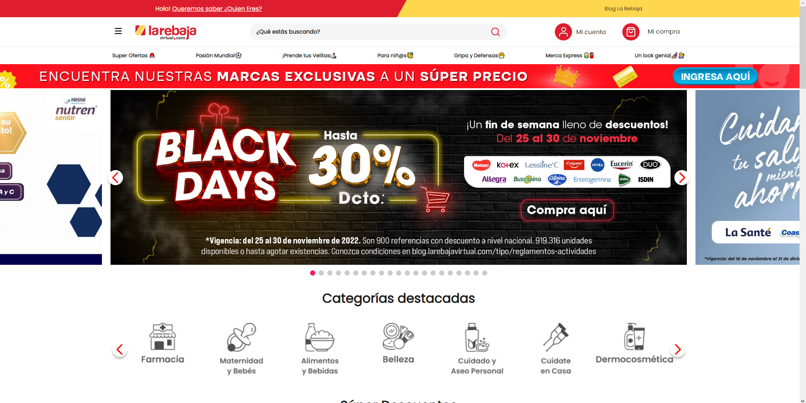
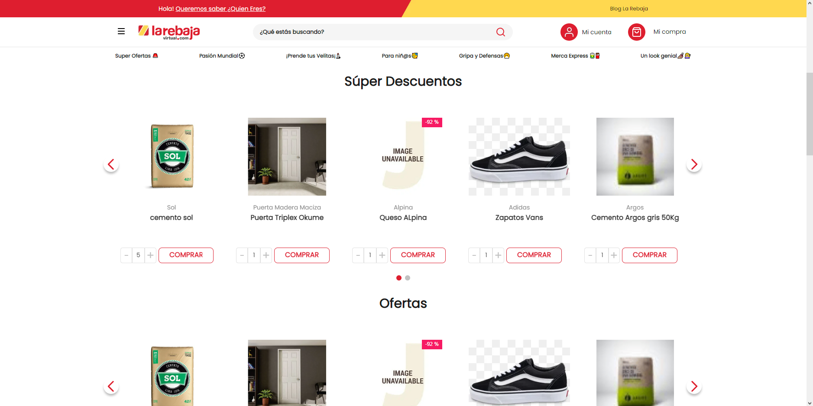
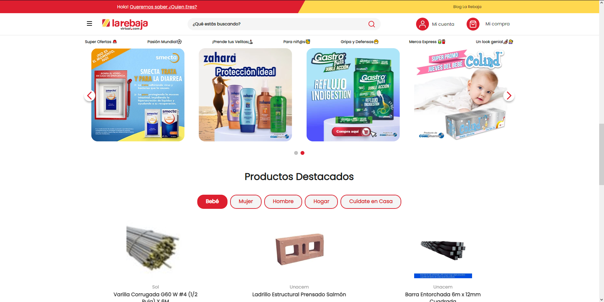
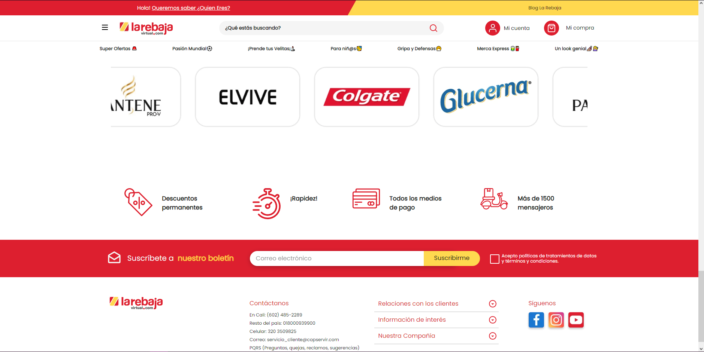
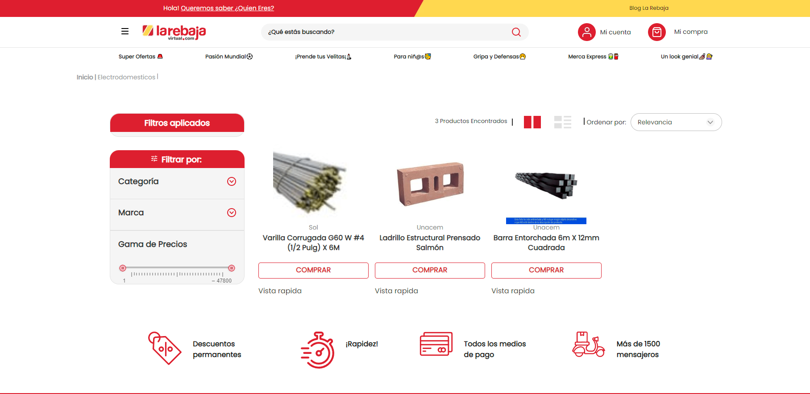
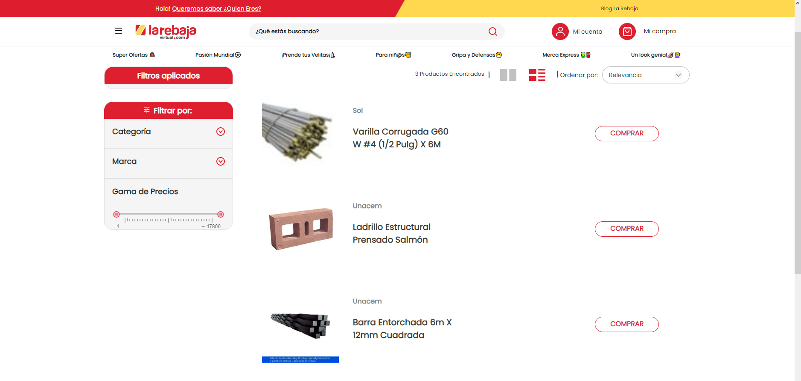
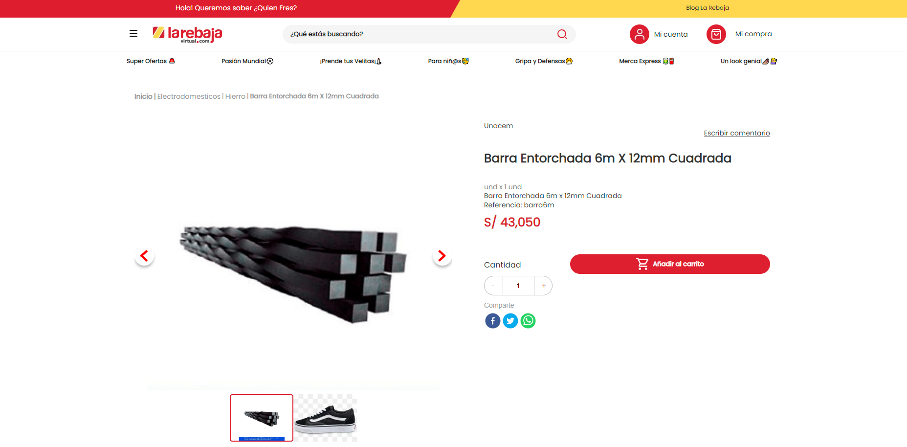
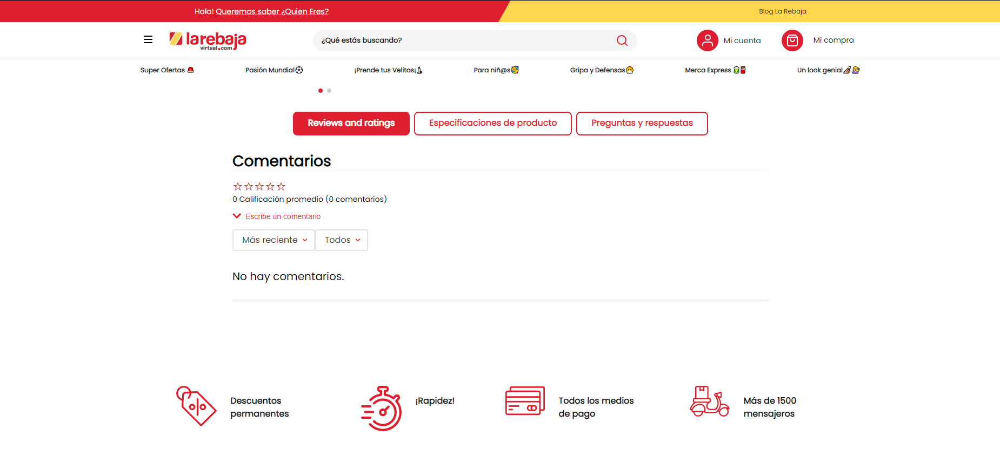

# La-rebaja-Vtex-IO
[La Rebaja Virtual](www.larebajavirtual.com) was my cloning choice for this project. This project have responsive views and it's really similar to the original store.

## Home view




## Search results view


## Page detail product (PDP)



---
## Configuration

### **Step 1** -  Basic setup

Access the VTEX IO [basic setup guide](https://vtex.io/docs/getting-started/build-stores-with-store-framework/1) and follow all the given steps. 

By the end of the setup, you should have the VTEX command line interface (Toolbelt) installed along with a developer workspace you can work in.

---
### **Step 2** - Cloning the repository

[Clone](https://help.github.com/en/github/creating-cloning-and-archiving-repositories/cloning-a-repository) this repository to your local files to be able to effectively start working on it.

Then, access the repository's directory using your terminal. 

---
### **Step 3** - Editing the `Manifest.json` an checking dependencies

Once in the repository directory, it is time to edit the `manifest.json` file. 

Once you are in the file, you must replace the `vendor` and `account` values. `vendor` is the account name you are working on and `account` is anything you want to name your theme. For example:

```json
{
  "vendor": "itgloberspartnercl",
  "name": "minumun-theme",
}
```
Before continue be sure the `manifest.json` have all his builders.
```json
"builders": {
    "assets": "0.x",
    "styles": "2.x",
    "store": "0.x",
    "docs": "0.x"
  }
```
 Check the project have all dependencies to work correctly
## Dependencies

```json
{
  "dependencies": {
    "vtex.store": "2.x",
    "vtex.store-header": "2.x",
    "vtex.product-summary": "2.x",
    "vtex.store-footer": "2.x",
    "vtex.store-components": "3.x",
    "vtex.styleguide": "9.x",
    "vtex.slider": "0.x",
    "vtex.carousel": "2.x",
    "vtex.shelf": "1.x",
    "vtex.menu": "2.x",
    "vtex.minicart": "2.x",
    "vtex.product-details": "1.x",
    "vtex.product-kit": "1.x",
    "vtex.search-result": "3.x",
    "vtex.login": "2.x",
    "vtex.my-account": "1.x",
    "vtex.flex-layout": "0.x",
    "vtex.rich-text": "0.x",
    "vtex.store-drawer": "0.x",
    "vtex.locale-switcher": "0.x",
    "vtex.product-quantity": "1.x",
    "vtex.product-identifier": "0.x",
    "vtex.product-specification-badges": "0.x",
    "vtex.product-review-interfaces": "1.x",
    "vtex.telemarketing": "2.x",
    "vtex.order-placed": "2.x",
    "vtex.stack-layout": "0.x",
    "vtex.tab-layout": "0.x",
    "vtex.responsive-layout": "0.x",
    "vtex.slider-layout": "0.x",
    "vtex.iframe": "0.x",
    "vtex.breadcrumb": "1.x",
    "vtex.sticky-layout": "0.x",
    "vtex.add-to-cart-button": "0.x",
    "vtex.store-image": "0.x",
    "vtex.store-icons": "0.x",
    "vtex.search": "2.x",
    "vtex.product-price": "1.x",
    "vtex.modal-layout": "0.x",
    "vtex.disclosure-layout": "1.x",
    "vtex.store-newsletter": "1.x",
    "vtex.store-link": "0.x",
  },
}
```
## Peer Dependencies
```json
{
  "peerDependencies": {
    "vtex.questions-and-answers": "0.x",
    "vtex.mega-menu": "2.x"
  },
}
```
## Custom Apps
```json
  {
    "itgloberspartnercl.whatsapp-button": "0.x"    
  }
```

---
### **Step 4** -  Installing required apps

In order to use Store Framework and work on your store theme, it is needed to have both `vtex.store-sitemap` and `vtex.store` installed.

Run  `vtex list`  and check whether those apps are already installed. 

If they aren't, run the following command to install them: 

`vtex install vtex.store-sitemap vtex.store -f`


---
### **Step 5** -  Uninstalling any existing theme

By running `vtex list`,  you can verify if any theme is installed.

It is common to already have a `vtex.store-theme`  installed when you start the store's front development process. 

Therefore, if you find it in the app's list, copy its name and use it together with the command `vtex uninstall`. For example:

```json
vtex uninstall vtex.store-theme
```

### **Step 6** - Run and preview your store

Then time has come to upload all the changes you made in your local files to the platform. For that, use the `vtex link` command. 

If the process runs without any errors, the following message will be displayed: `App linked successfully`. Then, run the `vtex browse` command to open a browser window having your linked store in it.

This will enable you to see the applied changes in real time, through the account and workspace in which you are working.

---
## Contributors
1. Enuar Montaña
